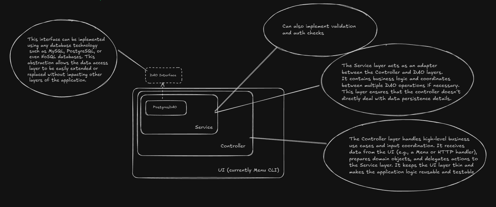

# Hilton Hotel Chain Management Application

This is a **Java-based CLI application** for managing the operations of a hotel chain like Hilton. It supports functionality for **Admins** to manage hotels, rooms, and guests, and for **Guests** to view rooms and make/cancel reservations.

---

## Project Structure

```
src/
└── main/
    ├── controller/            # Coordinates user interaction and business logic
    ├── dao/                   # Data Access Layer
    │   ├── interfaces/        # DAO interfaces
    │   └── postgresImpl/      # PostgreSQL-specific DAO implementations
    ├── database/              # DB connection interfaces and implementations
    ├── dto/                   # Data Transfer Objects (POJOs)
    ├── menu/                  # CLI menu handling (UI)
    ├── service/               # Business logic layer
    └── Main.java              # Application entry point
└── test/
    └── ReservationServiceTest.java  # Sample unit test using JUnit
```

---

## Design Patterns Used

This project follows several key **Object-Oriented Design Principles** and makes use of common **Design Patterns** to maintain scalability, readability, and testability.

### 1. **DAO Pattern (Data Access Object)**

Encapsulates database access logic to isolate it from business logic.

* **Purpose**: Decouples the data access layer from the rest of the application.
* **Example**: `GuestDAO`, `HotelDAO`, `RoomDAO`, and `ReservationDAO` interfaces along with their `Postgres...DAO` implementations.
* The underlying database can be changed by creating its implementation of DAO and passing it in the Service Layer.

### 2. **Service Layer Pattern**

Encapsulates business logic and orchestrates data flow between controllers and DAOs.

* **Purpose**: Promotes separation of concerns and supports reusability.
* **Example**: `GuestService`, `RoomService`, `ReservationService`, etc.

### 3. **Controller Pattern**

Handles user input, delegates work to services, and acts as the point of coordination between UI and business logic.

* **Purpose**: Follows the MVC idea of separating user interaction from logic.
* **Example**: `HotelController`, `RoomController`, `GuestController`, etc.

### 4. **Singleton Pattern**

Ensures that a single instance of the database connection is used throughout the application.

* **Purpose**: Efficient and consistent database access.
* **Example**: `PostgresDBConnection.getInstance()` in `PostgresDBConnection.java`.

### 5. **Factory Pattern (Planned or Partial)**

The instantiation of DAOs and services is centralized in the `Main.java` class. This pattern could be abstracted further using a factory method or dependency injection container.




---

## Features

### Admin Features

* **US01**: Add a new hotel
* **US02**: View hotel details
* **US03**: Add rooms to a hotel
* **US04**: View all rooms of a hotel
* **US05**: View specific room details
* **US06**: Add a guest to the system

### Guest Features

* **US07**: Make a reservation by providing check-in/check-out timestamps (supports full timestamp input `yyyy-MM-dd HH:mm:ss`)
* **US08**: Cancel an existing reservation
* **View available rooms** in a hotel

---

## Tech Stack

* Java (JDK 17+ recommended)
* PostgreSQL (JDBC-based)
* JUnit 5 for testing

---

## Running the Application

### 1. **Compile the code**

From the root directory (containing `src/`), run:

```bash
javac -d out -cp "src" $(find src -name "*.java")
```

> This will compile all `.java` files into the `out/` directory.

### 2. **Run the Application**

```bash
java -cp out main.Main
```

---

## Running Tests

If you're using Maven or Gradle, configure them with JUnit 5.

Or manually compile and run the test class:

```bash
javac -cp "libs/junit-platform-console-standalone-1.9.3.jar:src" -d out $(find src/test -name "*.java")
java -jar libs/junit-platform-console-standalone-1.9.3.jar -cp out --scan-classpath
```

---

## Database Setup

1. Install and run PostgreSQL.
2. Create a database named `hoteldb`.
3. Set up tables:

    ```sql
    CREATE TABLE hotel (
        id SERIAL PRIMARY KEY,
        name VARCHAR(255),
        location VARCHAR(255)
    );
    
    CREATE TABLE room (
        id SERIAL PRIMARY KEY,
        type VARCHAR(50),
        is_available BOOLEAN,
        hotel_id INT REFERENCES hotel(id)
    );
    
    CREATE TABLE guest (
        id SERIAL PRIMARY KEY,
        name VARCHAR(255),
        email VARCHAR(255),
        phone VARCHAR(20),
        hotel_id INT REFERENCES hotel(id)
    );
    
    CREATE TABLE reservation (
        id SERIAL PRIMARY KEY,
        guest_id INT REFERENCES guest(id),
        room_id INT REFERENCES room(id),
        check_in TIMESTAMP,
        check_out TIMESTAMP
    );
    ```

4. Update your DB credentials in `PostgresDBConnection.java`.

---

## Future Improvements

* Switch to GUI or Web-based UI
* Add support for different DB engines (NoSQL support)
* Add authentication for Admin and Guest
* Logging and auditing
* Dockerize the entire stack
